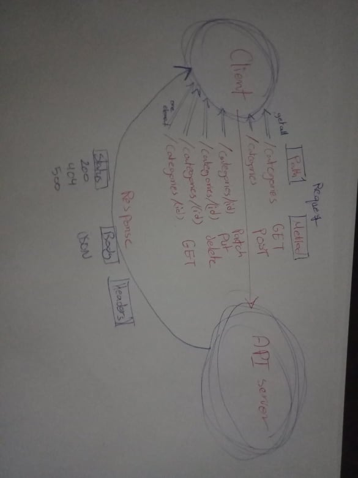

# Authenticated-api-server

### Author: Diana Alazzam 

### Links and Resources

- [Pull request](https://github.com/diana96alazzam-401-advanced-javascript/authenticated-api-server/pull/1)
- [ci/cd](https://github.com/diana96alazzam-401-advanced-javascript/authenticated-api-server/blob/lab15/.github/workflows/node.yml) (GitHub Actions)
- [back-end server url](https://authenticated-api-server-401.herokuapp.com/)
- [documentation](https://authenticated-api-server-401.herokuapp.com/docs)

### Setup

#### `.env` requirements
- `PORT` - 3000
- `MONGODB_URI` - `mongodb://localhost:27017/apiserver1`

#### Routes
- `/signup`:
  * POST: send username and password 
- `/signin`
  * POST: send username and password with basic authentication
- `/users`
  * GET: get all users from database
- `/api/v1/categories`:
  * POST: add a new category 
- `/api/v1/products`:
  * POST: add a new product 
- `/api/v1/categories`
  * GET: get all categories from database
- `/api/v1/products`
  * GET: get all products from database
- `/api/v1/categories/:id`
  * GET: get one categories from database
- `/api/v1/products/:id`
  * GET: get one products from database
- `/api/v1/categories/:id`
  * PUT: update one categories from database
- `/api/v1/products/:id`
  * PUT: update one products from database
- `/api/v1/categories/:id`
  * PATCH: update one categories from database
- `/api/v1/products/:id`
  * PATCH: update one products from database
- `/api/v1/categories/:id`
  * DELETE: delete one categories from database
- `/api/v1/products/:id`
  * DELETE: delete one products from database

#### How to initialize/run this application

- `nodemon`
- `npm start`

#### Tests

- `npm run lint`
- `npm test`

#### UML

- 
- 

